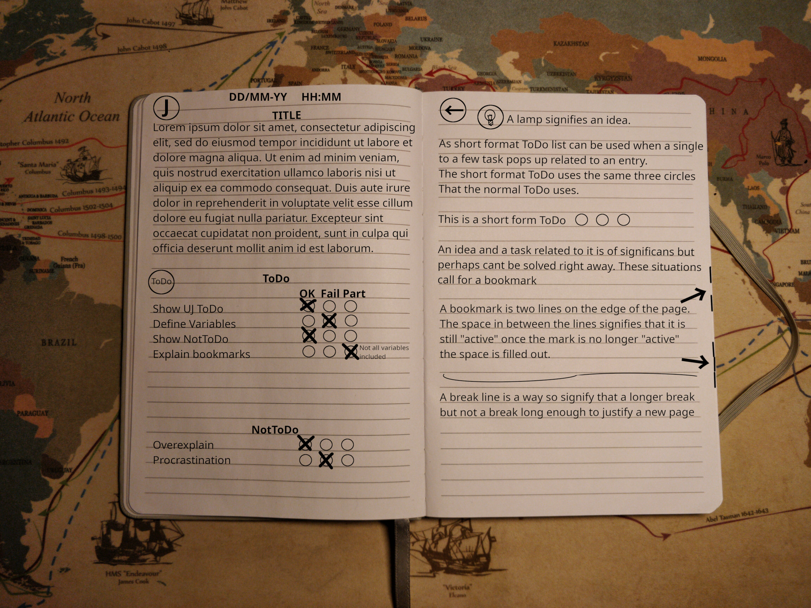

 

# UtilityJournal
## A Utilitarian approach to organized journaling

---

## The Goals of UJ

### Fast 
After a small initial setup of your notebook, there is no more prep needed. 
You just start to write and create the structure as you go. 
UJ is used for in-the-moment notes and tasks that need to be fixed in the near future. 

### Easy  
UJ is supposed to be easy to master.  
All you need is to read this article and remember a few icons and tricks.
No art degree is needed!  
  
### Portable  
Whether you use it to take notes in school, manage your groceries, design software, or write a diary UJ strives to accompany you in your tasks.  
It's also portable in the sense that one UJ journal is structured similarly to other UJ journals, except for personal icons but those can be easily indexed. 
  
### Available   
UJ is cheap and easy to get started with.  
The philosophy behind it is that every notebook should be able to use UJ.   
 * No specific type of notebook is required  
 * No specific type of pen  
 * Only one color of pen is needed  
 * No ruler or stamps are needed.   
 * No highlighters or pastel colors  
 * No need to have your life in order to the point that you can plan what books you will read in 18 months.   

**All you need (excluding the initial naming of the book) is any notebook and any type of pen.  
That's it!**

--- 

## Overview

This is an example  overview of multiple tricks from UJ.   
Refer back to this image while you read the guide. 

### The main structure of UJ

UJ uses icons to create structure and help visualize the contents of the notebook  
Each page in UJ uses an icon in the top left, this icon is called an "Entry Icon".  
Every new entry in your notebook will start with one of these icons. This shows what the entry is about.  
All following pages that are part of the same entry will have a leftward arrow icon, this will  
show that the page is part of an entry spanning multiple pages.   

All icons can be tailored to your needs but some are a part of standard UJ   
these are   

**(J)** = Journal entry  
**(W)** = Work  
**(S)** = Seminar  
**(L)** = List   
**(←)** = This page is part of a longer entry  

There are apart from the entry icons "In page icons"  
these are used to show when parts of the entry contain content that strays from the Entry Icon. 
Examples of in-page icons in Standard UJ: 

**(ToDo)** = ToDo list (this will be explained later)   
**(NotToDo)** = A list of what not to do, this is more useful than it seems  
**(:bulb:)** = An idea  
**(TA)** = "Talked about" a summary of a part, useful in seminars  
~ ~ **(Time)** ~ ~ = A time gap in the entry  
 
You can add more icons if need be. 

This way of organizing the notebook with Entry Icons will help you find the start and end of entries with ease. 
To make the entry more relevant the date, time and title should be added on the same row/rows as your initial Entry Icon. 
This will create a notebook that is flexible in creation and easy to follow when you flip through your notes. 

---

## The ToDo list
Most days you have a handful of tasks that you need/should do (o perhaps not do)  
The problem with other ToDo/Checklist/bullet points is there is no room for mistakes or miscalculations.  
You create a list and you have to live with that list for days/weeks or perhaps months.   
The UJ ToDo-list instead aims to create a faster more forgiving but not forgetting list.   
Note that UJ as a whole and its ToDo lists in particular are not created for repeating or long drawn out   
tasks. One entry is usually not "active" for more than an hour and a day at most.   

The UJ ToDo and NotToDo are structured in the same way  
First, add an in-page Icon for your to-do signifying the start of a list.  
Then you can name the list if you want but usually there is no need.   
Then you start to write down the tasks you want to accomplish on the left side of the page.   
Following each task there should be a small space.   
Then you draw three circles that are about as large as a capital O after the space.   
Make sure you leave some room after (AKA on the right of) the three circles.  
Now write the words  
OK Fail Part  
over the circles, one word per circle.  
This should result in a ToDo that looks like this: 
| = Start edges of the page 
 
| **(TODO)**   ListName      OK Fail Part       |  
| Task one &nbsp; &nbsp; &nbsp; &nbsp; &nbsp; &nbsp;  O   O   O &nbsp; &nbsp; &nbsp; &nbsp; &nbsp;  &nbsp;|  
| Task two &nbsp; &nbsp; &nbsp; &nbsp; &nbsp; &nbsp;  O   O   O &nbsp; &nbsp; &nbsp; &nbsp; &nbsp; &nbsp;|   
 
  
When you have added the tasks you can think of then you start to work on them.   
(Tips!) Always leave space after the tasks you add initially so you can add more later in case you forgot anything.   
Now to explain the circles!  
OK  
This means that the task is done! Nothing more to say.   
Fail   
means that the task Failed. Not that you failed. A personal failure could be the reason that a task fails but   
don't think about this as a failure but instead that it just didn't work out.   
Now if it failed you should write a short explanation for why in the space to the right of the circles.  
Example "No time left" or "Didn't have any eggs"   
Part  
This means that you did the task partially. For example, you planned on painting the fence but you only had time to paint  
half. As with the Fail state, you should write something to the right of the circles, e.g.: "Half done! Rain..."  
 
Now check the tasks as you complete them.   
When you have run out of time for the ToDo (Your workday ends, nighttime, etc.) you should check ALL the tasks.   
All tasks that you didn't have time to complete should be checked as Failed (No need to explain why).  
If you want to continue to work on the tasks in the list you will easily see what is done and not.  
If there are hindrances or if you lack resources.  
You will also realize when you don't have time to do something when you have rewritten the same task  
10 ToDo lists in a row you will see that it's perhaps better to move that task to a more long-term task management.  
This will help in not keeping old moldy ToDo lists around (Though if you like old moldy lists you can "Edge-mark" the ToDo, more on that later.)  

The NotTodo list works the same but write (NotToDo) in the icon.   
Combining these lists is very useful! For example, having a ToDo-list on one page followed by a NotToDo-list on the next.  
Examples of tasks to add to the NotToDo list:  
Watch series  
Eat snack  
Positive Procrastination  
Eat that first Chip  

### Single tasks. 
Sometimes you need to create a single task that needs to be done while you work on other things  
or writing a journal entry. 
By using the same three circles from the ToDo you can make that task stick out on the page, 
and it uses the same logic Todo so the three circles represent OK, Fail, and Part. 

ex: Remember to call mom for her birthday O O O

--- 

## Page markers

One of the problems with notebooks is being able to mark pages of interest.  
Marking things for future reference is handled with what in UJ is called page markers.  

Page markers are made by drawing two bold lines on the outer edge of the right page.  
These two markers should have a gap between them. This gap is used to show if the marker is "done" or not.  

This makes it easy to find what tasks are done and which need attention just by bending or flipping through  
the textblock.  

### Pointers 

Once a side note has been added but you want to highlight a specific part
of the page, you draw an arrow that shows where on the page the point of 
interest is. 

If there is a large part of the page or multiple parts of the page that is
of interest. Then you can "highlight" by drawing a ! at the start and 
end of the part of interest. 
Multiple arrows can also be used 

---

# Contributitons
Do you want to contribute with your own markers or do you have other improvements.  
Add your own PR! 

The project uses a quite restictive license since i dont want forts since i see this as a standard more than just a project.  
Conflicting standards would defeat the purpose.

<a property="dct:title" rel="cc:attributionURL" href="https://github.com/Nklobe/Utility-Journal/">UtilityJournal</a> by <a rel="cc:attributionURL dct:creator" property="cc:attributionName" href="https://squidishhead.com">Tobias Björkdahl</a> is licensed under <a href="http://creativecommons.org/licenses/by-nc-nd/4.0/?ref=chooser-v1" target="_blank" rel="license noopener noreferrer" style="display:inline-block;">Attribution-NonCommercial-NoDerivatives 4.0 International</a>
 
